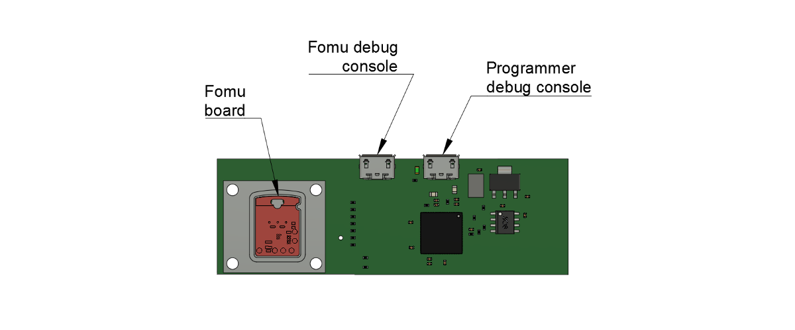

===============
Fomu Programmer
===============

Overview
========

This repository contains the open hardware design for `Antmicro's <https://antmicro.com>`_  programming board for Fomu, i.e. the FPGA incarnation of the `Tomu project <https://github.com/im-tomu/fomu-hardware>`_ - an FPGA that fits into your USB port (and the easiesy way to get started with FPGA and/or RISC-V development).
The programmer lets you upload initial firmware into your Fomu over a micro-USB connection.
It is based on a two-channel FT2232 FTDI interface providing JTAG and debug UART interfaces.
Along with PCB design files the repository describes also a Fomu fastening mechanism with a mechanical lever and a PCB fixture which makes Fomu programming more convenient.

Board layout
============

The picture below presents the general layout of the PCB with interface connectors marked.

Getting started
===============

The PCB design files define the board layout and recommended stackup for generating the Gerber files.
Please refer to the schematic sheets for more information.
You will need to 3D-print a testbed that will hold your Fomu against the test needles soldered to the PCB.
The programmer enumerates on the host PC as a typical-two channel FTDI device seen under ``/dev/ttyUSB0`` and ``/dev/ttyUSB1`` (assuming no other USB/serial devices are connected)

Please refer to Fomu firmware programming guidelines for further information regarding software setup and flashing.

License
=======

MIT

Copyright (c) 2019 `Antmicro <www.antmicro.com>`_
